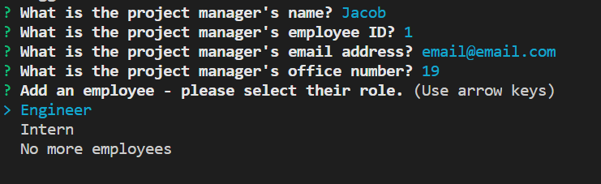

# My_team

## Description
This command line tool allows you to dynamicly create an HTML page for a team of employees. My_Team will first prompt you for information about your team manager, such as name, employee ID and email, then allow you to add any number of engineers or interns and prompt you for their information as well. Once the information has been collected, a custom HTML page will be generated and display cards for each memeber of the team showing their specific information!

## My_team in action
https://drive.google.com/file/d/1PeLXaHyJvFGAEdo2xPdhUjJTTcyuw5MC/view

